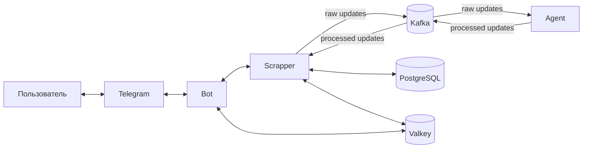

# LinkTracker

<b>LinkTracker</b> — Telegram-бот и набор сервисов для отслеживания изменений по ссылкам и уведомления пользователя.

<p>
	<a href="https://go.dev/"></a>
	<a href="https://www.docker.com/"></a>
	<a href="https://core.telegram.org/bots/api"></a>
	<a href="https://www.postgresql.org/"></a>
	<a href="https://kafka.apache.org/"></a>
	<a href="https://valkey.io/"></a>
	<a href="https://grpc.io/"></a>
	<a href="https://www.openapis.org/"></a>
</p>

## Описание

Проект организован как набор сервисов:

- **Bot** — Telegram-бот: принимает команды пользователя и отправляет уведомления.
- **Scrapper** — мониторинг ссылок: хранит подписки/состояние, опрашивает источники и публикует обновления.
- **Agent** — интеллектуальная обработка: фильтрация/суммаризация обновлений (опционально через внешний AI-провайдер).

Инфраструктура из коробки поднимается через Docker Compose:

- **PostgreSQL** — хранение данных
- **Liquibase** — миграции схемы БД
- **Kafka** — доставка событий/обновлений между сервисами
- **Valkey Cluster** — кеширование

## Структура проекта

```text
cmd/            # main-пакеты (входные точки)
  bot/
  scrapper/
  agent/
internal/       # основная логика приложения
  handlers/     # REST/RPC/Broker хендлеры
  service/      # бизнес-логика
  repository/   # доступ к данным
  broker/       # Kafka producer/consumer
  cache/        # Valkey/cache-ноды + fallback
  domain/       # доменные модели
  adapter/      # внешние адаптеры/клиенты
db/migrations/  # миграции БД (Liquibase)
docker/         # Dockerfile’ы сервисов
openapi/        # OpenAPI спецификации
proto/          # gRPC proto-контракты
tests/          # интеграционные и нагрузочные тесты
```

## Внешние API

В проекте используются следующие внешние API:

* [Telegram Bot API](https://core.telegram.org/bots/api) — взаимодействие с Telegram (SDK: `github.com/go-telegram-bot-api/telegram-bot-api/v5`)
* [GitHub REST API](https://docs.github.com/en/rest) — данные о репозиториях/коммитах/PR/issue
* [StackOverflow API](https://api.stackexchange.com/docs) — данные о вопросах/ответах

Опционально (для Agent): внешние AI API (ключи задаются через `.env`).

## Схема взаимодействия



## Быстрый старт (Docker)

### Требования

- Docker + Docker Compose

### Шаги

1) Создать `.env` по образцу `.env.example` и заполнить как минимум `BOT_TOKEN`.

2) Создать `config.yaml` по образцу `config.yaml.example`.

3) Запустить сервисы:

```bash
docker compose up -d --build
```

4) Проверить состояние:

```bash
docker compose ps
docker compose logs -f scrapper
docker compose logs -f bot
```

## Команды Telegram-бота

Команды, которые поддерживает бот:

| Команда | Описание | Примечания |
|---|---|---|
| `/start` | Начать общение с ботом | Регистрирует чат и предлагает открыть `/help` |
| `/help` | Список доступных команд | Показывает полный список команд |
| `/track` | Добавить ссылку для отслеживания | Запускает пошаговый ввод: ссылка → теги → фильтры |
| `/untrack` | Прекратить отслеживание ссылки | Попросит ввести ссылку для удаления |
| `/list` | Получить список отслеживаемых ссылок | Можно фильтровать по тегу: `/list <tag>` |
| `/cancel` | Отменить текущий флоу | Удобно, если передумали добавлять/удалять |

## Сценарий использования

Ниже — типичный сценарий для пользователя в Telegram:

1) Откройте бота в Telegram и отправьте:

- `/start`

2) Посмотрите доступные команды:

- `/help`

3) Добавьте ссылку для отслеживания:

- `/track`
- отправьте ссылку (например, репозиторий GitHub `https://github.com/golang/go` или вопрос StackOverflow `https://stackoverflow.com/questions/11828270/how-do-i-exit-the-vim-editor`)
- на запрос **«Введите теги»** отправьте теги через запятую (например, `news, personal`) или `-`
- на запрос **«Введите фильтры»** отправьте фильтры через запятую или `-`

4) Посмотрите, что сейчас отслеживается:

- `/list` — все ссылки
- `/list news` — ссылки только с тегом `news`

5) Получайте уведомления об изменениях: когда бот обнаружит обновления по ссылкам, он пришлёт сообщение в этот чат.

6) Если нужно прекратить отслеживание:

- `/untrack`
- отправьте ссылку, которую нужно удалить

7) Если начали ввод и передумали — отмените текущий шаг:

- `/cancel`

## Контракты API

- OpenAPI: [openapi/bot-api.yaml](./openapi/bot-api.yaml), [openapi/scrapper-api.yaml](./openapi/scrapper-api.yaml)
- gRPC proto: [proto/scrapper-api.proto](./proto/scrapper-api.proto)

## Нагрузочное тестирование

Отчет: [tests/load/LOAD_TEST_REPORT.md](./tests/load/LOAD_TEST_REPORT.md)
